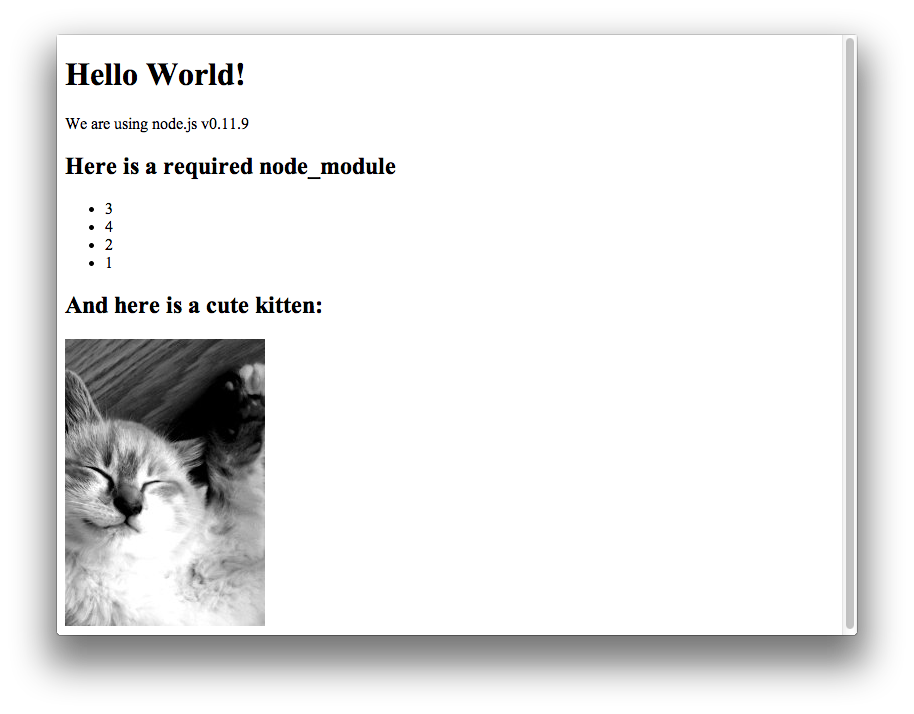

Example app with grunt-node-webkit-builder
===========

This example should give you everything you need to get started with a node-webkit project using grunt-node-webkit.

Building
------

To build the app, run the following commands:

    npm install
    cd public/ && npm install && cd -
    grunt nodewebkit

By default the app will build a Mac and Windows app, but not Linux 32 or 64 apps.  You can change this by modifying `Gruntfile.js`.

Running (Mac)
----

On Mac, you can now open your app using:

    open build/releases/nw-demo/mac/nw-demo.app/

You should see the following:

Notice that the app icon is also our custom icon specified in `icon.icns` rather than the default node-webkit icon.